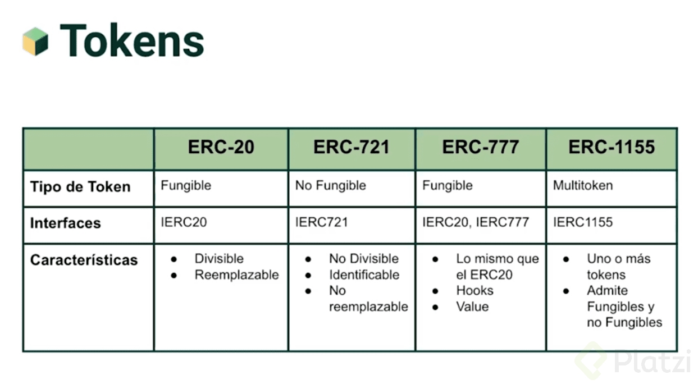
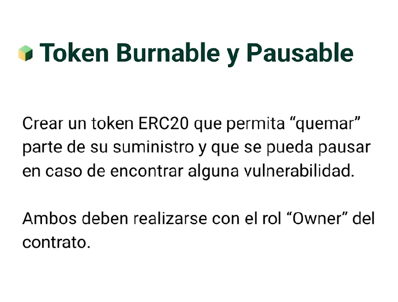
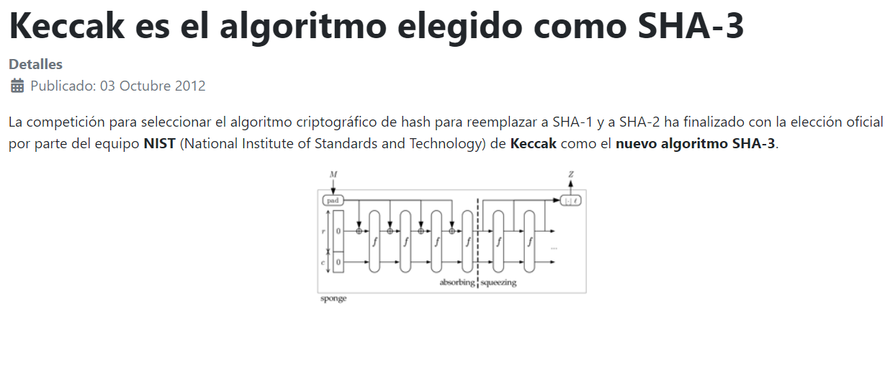
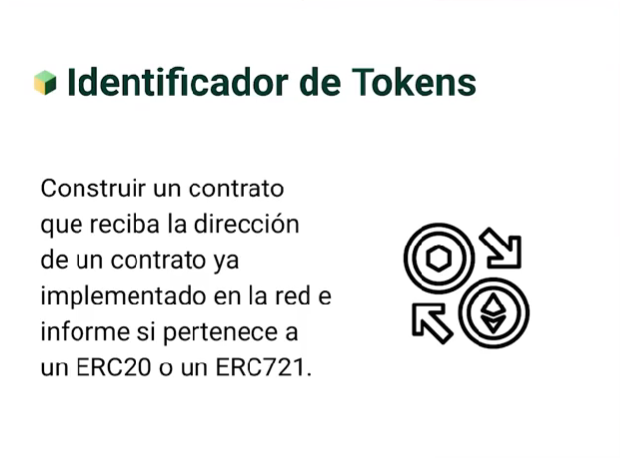

# Understanding OpenZeppelin Contracts



## Solution challenge 2



## Article for security

["Security article"](https://www.cyberseguridad.net/keccak-es-el-algoritmo-elegido-como-sha-3)


openzeppelin-contracts/contracts/utils/escrow at master · OpenZeppelin/openzeppelin-contracts · GitHub

["Contract Scrow for allow deposits and withdrawals"](https://github.com/OpenZeppelin/openzeppelin-contracts/tree/master/contracts/utils/escrow)

```solidity
  function deposit(address payee) public payable virtual onlyOwner {
    uint256 amount = msg.value;
    _deposits[payee] += amount;
    emit Deposited(payee, amount);
  }

  function withdraw(address payable payee) public virtual onlyOwner {
    uint256 payment = _deposits[payee];

    _deposits[payee] = 0;

    payee.sendValue(payment);

    emit Withdrawn(payee, payment);
  }
```

## Useful to check inheritance in contracts

["Useful to check inheritance in contracts"](https://github.com/OpenZeppelin/openzeppelin-contracts/tree/master/contracts/utils/introspection)
["Good way to work with arrays"](https://github.com/OpenZeppelin/openzeppelin-contracts/tree/master/contracts/utils/structs)

## Solution challenge 3



## Usefull commands

```shell
npx hardhat help
npx hardhat test
GAS_REPORT=true npx hardhat test
npx hardhat node
npx hardhat run scripts/deploy.ts
```
